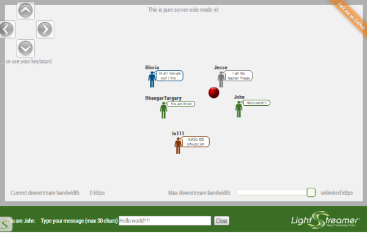

# Lightstreamer - Room-Ball Demo - HTML Client #

<!-- START DESCRIPTION lightstreamer-example-roomball-client-javascript -->

This project includes a web client front-end example for the [Lightstreamer - Room-Ball Demo - Java Adapter](https://github.com/Weswit/Lightstreamer-example-RoomBall-adapter-java).

## Room-Ball Demo ##

[](http://demos.lightstreamer.com/RoomBallDemo)<br>
An online demonstration is hosted on our servers at:[http://demos.lightstreamer.com/RoomBallDemo](http://demos.lightstreamer.com/RoomBallDemo)<br>

[](http://demos.lightstreamer.com/RoomBallDemo)<br>
An online demonstration is hosted on our servers at:[http://demos.lightstreamer.com/RoomBallDemo](http://demos.lightstreamer.com/RoomBallDemo)<br>


This <b>Room-Ball Demo</b> implements a simple gaming/collaborative application fed in real time via a Lightstreamer server.<br>
Once logged in, the user can start move his or her avatar in the room and exchange messages with every other user present in the demo. For each user is created an avatar of a specific background color, on top of which the nickname chosen by the user is displayed and the balloon with the last typed message appears to the right.<br>
User messages are broadcasted as you type, character by character, to all other users.<br>
The red ball is a passive object that you can push in different directions with your avatar.<br>

The demo includes the following client-side functionalities:
* A [Subscription](http://www.lightstreamer.com/docs/client_javascript_uni_api/Subscription.html) containing 1 item, subscribed to in <b>COMMAND</b> mode.
* The user messages are sent to the Lightstreamer Server using the [LightstreamerClient.sendMessage](http://www.lightstreamer.com/docs/client_javascript_uni_api/LightstreamerClient.html#sendMessage) utility.

<!-- END DESCRIPTION lightstreamer-example-roomball-client-javascript -->
# Deploy #

Before you can run the demo some dependencies need to be solved:

-  Get the lightstreamer.js file from the [latest Lightstreamer distribution](http://www.lightstreamer.com/download) 
   and put it in the src/js folder of the demo. Alternatively you can build a lightstreamer.js file from the 
   [online generator](http://www.lightstreamer.com/distros/Lightstreamer_Allegro-Presto-Vivace_5_1_1_Colosseo_20130305/Lightstreamer/DOCS-SDKs/sdk_client_javascript/tools/generator.html).
   In that case be sure to include the LightstreamerClient, Subscription, DynaGrid, and StatusWidget modules and to use the "Use AMD" version.
-  Get the require.js file from [requirejs.org](http://requirejs.org/docs/download.html) and put it in the src/js folder of the demo.
-  Get the jquery.qtip-1.0.0-rc3.min.js file from [qtip download page](http://craigsworks.com/projects/qtip/download/) and put it in the src/js folder of the demo.
-  Please note that the demo uses a jQuery customized theme, included in this project.

You can deploy this demo in order to use the Lightstreamer server as Web server or in any external Web Server you are running. 
If you choose the former case please note that in the <LS_HOME>/pages/demos/ folder there is a copy of the /src directory of this project, if this is non your case please create the folders <LS_HOME>/pages/demos/RoomBallDemo then copy here the contents of the /src folder of this project.<br>
The client demo configuration assumes that Lightstreamer Server, Lightstreamer Adapters and this client are launched on the same machine. If you need to targeting a different Lightstreamer server please search this line:
```js
var lsClient = new LightstreamerClient(null,"ROOMBALL");
```
in js/lsClient.js file and change it accordingly (replace null with your server URI).<br>
Anyway the [ROOMBALL](https://github.com/Weswit/Lightstreamer-example-RoomBall-adapter-java) Adapters have to be deployed in your local Lightstreamer server instance.
The demo are now ready to be launched.

# See Also #

## Lightstreamer Adapters Needed by This Demo Client ##

<!-- START RELATED_ENTRIES -->
* [Lightstreamer - Room-Ball Demo - Java Adapter](https://github.com/Weswit/Lightstreamer-example-RoomBall-adapter-java)
* [Lightstreamer - Reusable Metadata Adapters - Java Adapter](https://github.com/Weswit/Lightstreamer-example-ReusableMetadata-adapter-java)

<!-- END RELATED_ENTRIES -->

## Related Projects ##

* [Lightstreamer - Chat-Tile Demo - JQuery Client](https://github.com/Weswit/Lightstreamer-example-ChatTile-client-javascript)
* [Lightstreamer - Chat Demo - HTML Client](https://github.com/Weswit/Lightstreamer-example-Chat-client-javascript)
* [Lightstreamer - Round-Trip Demo - HTML Client](https://github.com/Weswit/Lightstreamer-example-RoundTrip-client-javascript)
* [Lightstreamer - Basic Messenger Demo - HTML Client](https://github.com/Weswit/Lightstreamer-example-Messenger-client-javascript)
* [Lightstreamer - 3D World Demo - Three.js Client](https://github.com/Weswit/Lightstreamer-example-3DWorld-client-javascript)

# Lightstreamer Compatibility Notes #

- Compatible with Lightstreamer JavaScript Client library version 6.0 or newer.