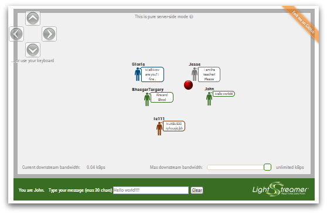

# Lightstreamer - Room-Ball Demo - HTML Client #

<!-- START DESCRIPTION lightstreamer-example-roomball-client-javascript -->

This project includes a web client front-end example for the [Lightstreamer - Room-Ball Demo - Java Adapter](https://github.com/Weswit/Lightstreamer-example-RoomBall-adapter-java).

## Live Demo
[](http://demos.lightstreamer.com/RoomBallDemo)<br>
###[ View live demo](http://demos.lightstreamer.com/RoomBallDemo)

## Details

This *Room-Ball Demo* implements a simple gaming/collaborative application fed in real-time via a Lightstreamer server.<br>
Once logged in, the user can start moving his or her avatar in the room and exchange messages with every other user present in the demo. For each user, an avatar of a specific background color is created, on top of which the nickname chosen by the user is displayed and the balloon with the last typed message appears to the right.<br>
User messages are broadcasted as you type, character by character, to all other users.<br>
The red ball is a passive object that you can push in different directions with your avatar.<br>

The demo includes the following client-side functionalities:
* A [Subscription](http://www.lightstreamer.com/docs/client_javascript_uni_api/Subscription.html) containing 1 item, subscribed to in <b>COMMAND</b> mode.
* The user messages are sent to the Lightstreamer Server using the [LightstreamerClient.sendMessage](http://www.lightstreamer.com/docs/client_javascript_uni_api/LightstreamerClient.html#sendMessage) utility.

<!-- END DESCRIPTION lightstreamer-example-roomball-client-javascript -->

## Install

If you want to install a version of this demo pointing to your local Lightstreamer Server, follow these steps:

* Note that, as prerequisite, the [Lightstreamer - Room-Ball Demo - Java Adapter](https://github.com/Weswit/Lightstreamer-example-RoomBall-adapter-java) has to be deployed on your local Lightstreamer Server instance. Please check out that project and follow the installation instructions provided with it.
* Launch Lightstreamer Server.
* Get the `lightstreamer.js` file from the [latest Lightstreamer distribution](http://www.lightstreamer.com/download) and put it in the `src/js` folder of the demo. Alternatively, you can build a `lightstreamer.js` file from the 
[online generator](http://www.lightstreamer.com/docs/client_javascript_tools/generator.html). In that case, be sure to include the LightstreamerClient, Subscription, DynaGrid, and StatusWidget modules and to use the "Use AMD" version.
* Get the `require.js file` from [requirejs.org](http://requirejs.org/docs/download.html) and put it in the `src/js` folder of the demo.
* Get the `jquery.qtip-1.0.0-rc3.min.js` file from [qtip download page](http://craigsworks.com/projects/qtip/download/) and put it in the `src/js` folder of the demo.
* Please note that the demo uses a jQuery customized theme, included in this project.

You can deploy this demo to use the Lightstreamer server as Web server or in any external Web Server you are running. 
If you choose the former case, please create the folders `<LS_HOME>/pages/demos/RoomBallDemo`, then copy here the contents of the `/src` folder of this project.<br>
The client demo configuration assumes that Lightstreamer Server, Lightstreamer Adapters, and this client are launched on the local machine. If you need to target a different Lightstreamer server, open `js/Constants.js` file and change the SERVER property accordingly.
```js
 SERVER: protocolToUse+"//localhost:8080"
```

The demo is now ready to be launched.

## Build

The html applications can be optionally built, to reduce the number and size of the files to be downloaded by the browser, using [r.js](http://requirejs.org/docs/optimization.html). A ready-made configuration file for the build process of the *Room-Ball Demo* is available in the `build_r.js` folder of this project.

The build is configured to use [Google Closure compiler](https://code.google.com/p/closure-compiler/) to minify the files. To run it as is, you need to download [rhino](https://developer.mozilla.org/en-US/docs/Rhino) `js.jar` file, `compiler.jar` from the closure compiler project and `r.js` from RequireJS. You also need a [Java Virtual Machine](https://www.java.com/en/download/) installed on your system.

Once ready, from the `build_r.js` folder, run

```cmd
java -cp compiler.jar;js.jar org.mozilla.javascript.tools.shell.Main r.js -o app.build.js
```

As an alternative, it is possible to customize the build file to use [UglifyJS](https://github.com/mishoo/UglifyJS2); in this case, it can be built using [node.js](http://nodejs.org/) instead of using the JVM.

## See Also

### Lightstreamer Adapters Needed by This Client

<!-- START RELATED_ENTRIES -->
* [Lightstreamer - Room-Ball Demo - Java Adapter](https://github.com/Weswit/Lightstreamer-example-RoomBall-adapter-java)
* [Lightstreamer - Reusable Metadata Adapters - Java Adapter](https://github.com/Weswit/Lightstreamer-example-ReusableMetadata-adapter-java)

<!-- END RELATED_ENTRIES -->

### Related Projects

* [Lightstreamer - Chat-Tile Demo - JQuery Client](https://github.com/Weswit/Lightstreamer-example-ChatTile-client-javascript)
* [Lightstreamer - Chat Demo - HTML Client](https://github.com/Weswit/Lightstreamer-example-Chat-client-javascript)
* [Lightstreamer - Round-Trip Demo - HTML Client](https://github.com/Weswit/Lightstreamer-example-RoundTrip-client-javascript)
* [Lightstreamer - Basic Messenger Demo - HTML Client](https://github.com/Weswit/Lightstreamer-example-Messenger-client-javascript)
* [Lightstreamer - 3D World Demo - Three.js Client](https://github.com/Weswit/Lightstreamer-example-3DWorld-client-javascript)

## Lightstreamer Compatibility Notes

* Compatible with Lightstreamer JavaScript Client library version 6.0 or newer.
